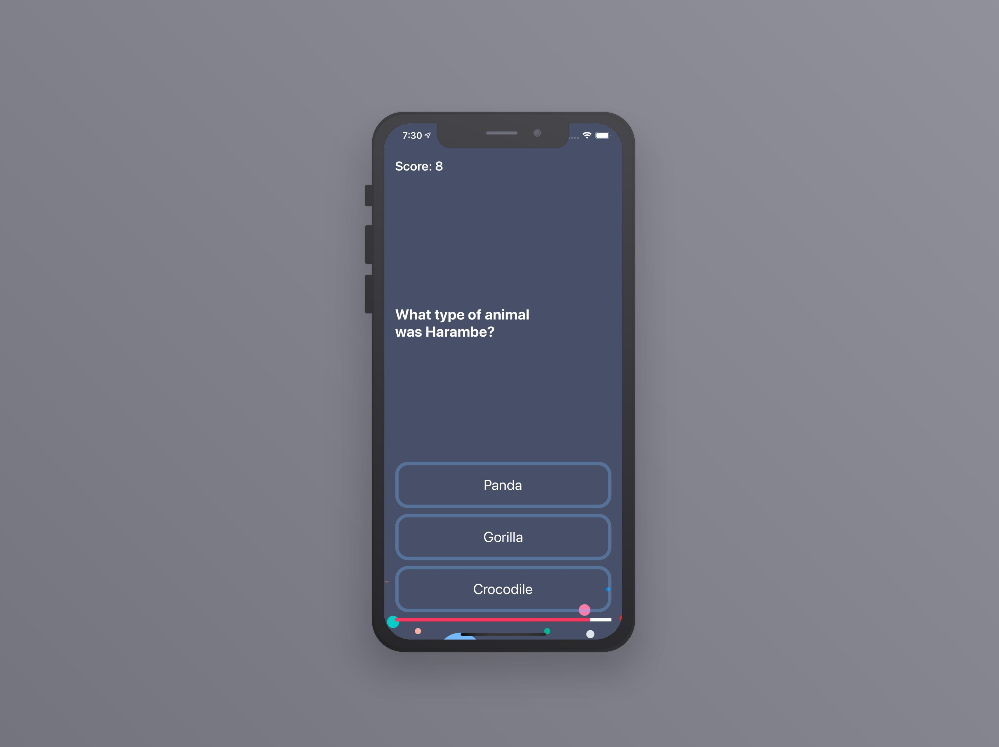

<!-- PROJECT LOGO -->
 

   
  <h2 align="center">BookStore</h2>

A book store app for searching and purchasing all those books that you want to read.

 

### Technologies Used

`Swift 5`  `SwiftUI`  `Combine`

### Architecture Used

`MVVM`
